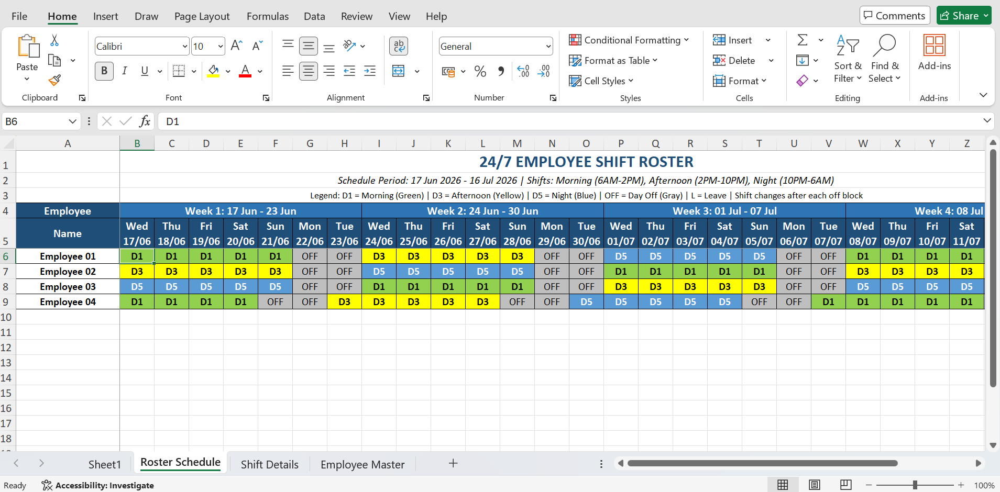
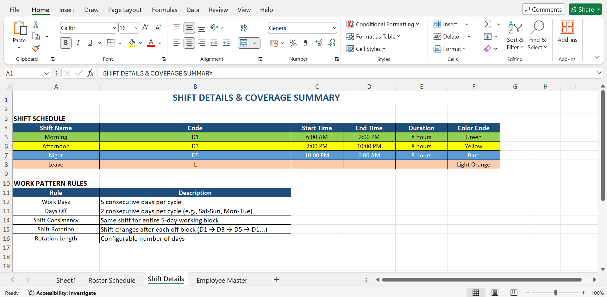
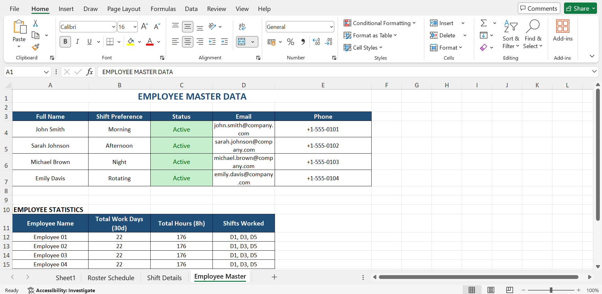

# Roster Generator (Go)

This folder contains the Go program that generates the Excel roster (`.xlsx`) and updates a single JSON config file with scheduling continuity.

## Output Preview

The application generates a comprehensive Excel workbook with multiple sheets showing employee shift schedules and details.

### Roster Schedule
The main roster sheet displays all employees' shift assignments across a configurable date range, with color-coded shifts (Morning, Afternoon, Night) and days off.



### Shift Details & Coverage Summary
This sheet provides shift definitions, work pattern rules, and coverage information for effective workforce planning.



### Employee Master Data
The employee master sheet contains contact information, shift preferences, and work statistics for all team members.



## Config file

By default the tool reads/writes `roster_config.json` in this folder (or the path you pass via `--config`).

### `randomizeShifts`

- `true`: shift is selected pseudo-randomly each 7-day cycle for each employee (but still deterministic across runs because it uses the employee name + cycle index).
- `false`: shift follows fixed rotation `D1 → D3 → D5` when a new 7-day cycle starts.

Note: the tool always writes this field back to the config so your chosen value is preserved.

### `continuity` (per employee)

`continuity` is **auto-managed state** that allows the next run to continue exactly where the previous run ended (so month boundaries don’t reset anything).

You normally do **not** edit `continuity` manually.

Fields:
- `shift`: the current shift code for the employee (`D1`, `D3`, `D5`).
- `cycleDay`: position in the repeating 7-day pattern (0..6), where:
  - 0..4 are working days
  - 5..6 are OFF days
- `cycleIndex`: counts completed 7-day cycles; used to keep randomized shift selection stable across runs when `randomizeShifts=true`.

How it’s used:
- The tool starts from `nextRosterStartDate` and each employee’s `continuity`.
- After generating the roster, it updates each employee’s `continuity` and advances `nextRosterStartDate` to the day after the generated range.

Resetting continuity:
- If you want to restart scheduling from scratch, run with `--reset-state`.
- Alternatively (manual), you can remove `continuity` blocks and set `nextRosterStartDate` to a new date, but `--reset-state` is the safer/cleaner option.

### Leaves

Add leave ranges under an employee’s `leaves` list:

```json
{
  "from": "2026-04-10",
  "to": "2026-04-15"
}
```

On leave days the roster shows `L`.

## Download release binaries

Release binaries are published automatically when a Git tag matching `v*.*.*` is pushed.

- Linux executable:
  `https://github.com/rajatvyadav/Roster-Generator-Go/releases/download/<tag>/Roster-Generator-Go-linux-amd64`
- Windows executable:
  `https://github.com/rajatvyadav/Roster-Generator-Go/releases/download/<tag>/Roster-Generator-Go-windows-amd64.exe`

Replace `<tag>` with the release version, for example `v1.0.0`.

GitHub release assets are published as release downloads and do not expire.

## Common workflows

- Add employee: add a new entry in `employees` with `active: true` (omit `continuity` and it will be initialized automatically).
- Remove employee: set `active: false` (their continuity stays in the file, but they won’t be scheduled).
